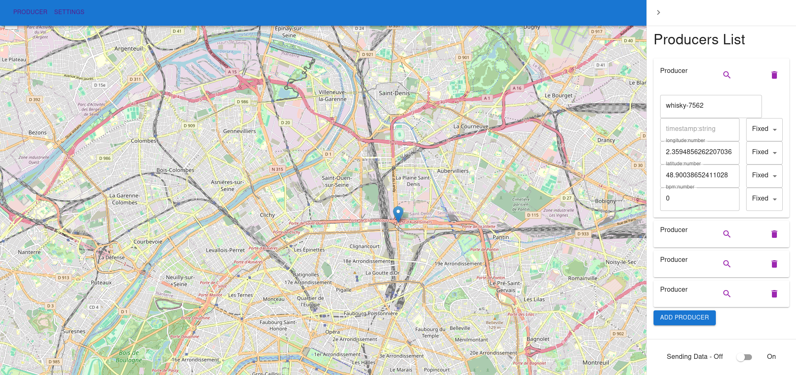
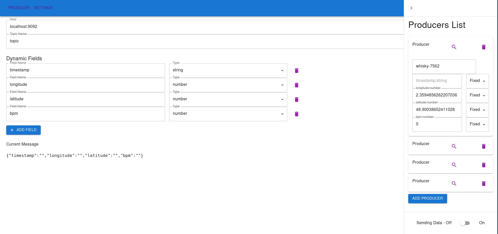

# kafka-geoproducer-ui

This project is a simple UI to simulate devices sending geolocation data to a Kafka topic in JSON format.




## Features
- Default message: deviceId, latitude, longitude, timestamp
- Multiple simulated devices
- Interactive map to select the location for each device
- Kafka server configuration (host, port, topic)
- Start/Stop sending messages to Kafka
- Adding/Removing message fields
- Supported field types: string, number

## How to run

0. Prerequisites
- Node.js
- pnpm

1. Clone the repository
```bash
git clone https://github.com/Erdnaxela3/kafka-geoproducer-ui.git
cd kafka-geoproducer-ui
```

2.1 Run the backend
```bash
cd backend
npm install
node kafkaServer.js
```

2.2 Run the frontend
```bash
cd frontend
pnpm install
pnpm run dev
```

3. Open your browser and go to `http://localhost:5173`

## Features to be added
- [ ] Support for more field types
- [ ] Support for more message formats (e.g. Avro, Protobuf)
- [ ] Randomizing message fields for each device (number: range, set, etc.)
